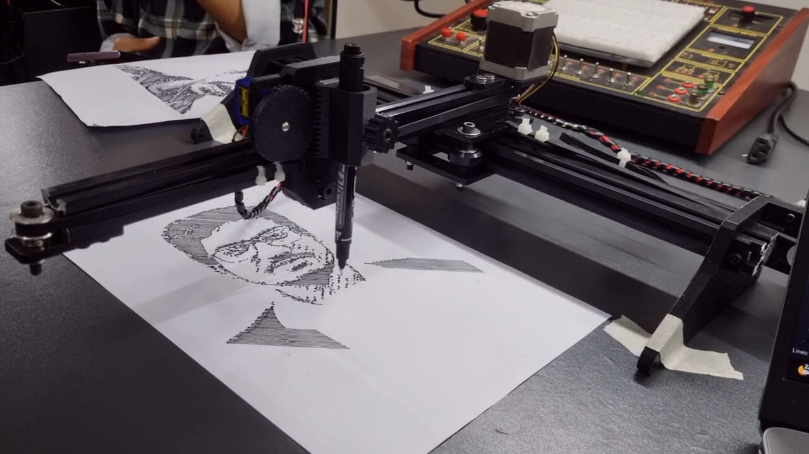

# Smart CNC Automated Pen Plotter
This project presents a fully automated system that converts a user-selected image into CNC-compatible G-code for a pen plotter machine. The system integrates AI background removal, image processing, vector conversion, and toolpath generation into a single workflow.
---

# Project Overview
The goal of this project is to simplify the process of converting images into CNC pen plotter drawings.

Traditional workflows require multiple tools and manual processing steps. This system automates the entire pipeline from image selection to final G-code generation using a graphical interface and Python-based backend processing.
---

## Features 
- Fully automated image-to-Gcode pipeline
- Dual drawing modes
   1. Outline Mode
   2. Shading / Hatch Mode
- AI background removal
- Automatic raster to vector
- CNC machine scaling
- Automatic G-code generation
- Compatible with LaserGRBL and other G-code senders
---

## System Workflow
```
User Image + Mode Selection
        ↓
AI Background Removal
        ↓
White Background Conversion
        ↓
Mode Selection
   /           \
Outline       Shading
   \           /
Raster → Vector (SVG)
        ↓
SVG Cleanup
        ↓
G-Code Generation
        ↓
G-Code Sender
        ↓
CNC Pen Plot Drawing
```
 ---
 
 ## Hardware Used
 - CNC Pen Plotter Frame
 - Stepper Motors (X–Y Axis)
 - Servo Motor (Pen Up / Down Control)
 - Arduino Uno
 - CNC Shield
 - Stepper Motor Drivers
 - Power Supply Unit
 ---

## Software Stack
This project uses the following technologies:

- **Python**
- **Tkinter** – GUI development
- **Pillow** – Image processing
- **Requests** – API communication
- **svgpathtools** – SVG path processing
- **Potrace** – Raster to vector conversion
- **LaserGRBL / Universal G-code Sender** – CNC machine control
---

## Project Structure
```
smart-cnc-automated-pen-plotter │ ├── GUI.py                # Graphical user interface ├── ftest2.py             # Image processing + G-code generation ├── README.md             # Project documentation ├── requirements.txt      # Python dependencies │ └── images └── cnc_machine.jpg   # CNC machine photo
```
---

## Installation
Install the required Python libraries:
```
 pip install pillow
 pip install requests
 pip install svgpathtools
 pip install numpy
 pip install opencv-python
 ```
Or install using:
```
 pip install -r requirements.txt
```
---

## Background Removal API
This project requires an external **background removal API** to remove the background from input images.

The current implementation uses *Picsart Remove Background API*, but other tools or services can also be used such as:

- Remove.bg
- Replicate AI models
- Any custom background removal API

The API key should be configured as an environment variable before running the project.
---

## Vector Conversion Tool

This project requires a **raster-to-vector conversion tool** to convert processed images into SVG paths.

The current implementation uses **Potrace**, but other tools can also be used such as:

- Potrace
- AutoTrace
- Inkscape CLI
- Any raster-to-vector conversion tool

The tool should generate **SVG vector paths** that can be processed by the system for G-code generation.
---

## Running the Project
Make sure the following files are in the same directory:

- GUI.py  
- ftest2.py  

Run the application:
GUI.py
---

### Steps

1. Select an image
2. Choose processing mode

Mode 1 → Outline  
Mode 2 → Shading

3. Click **RUN PROCESS**

The system will automatically process the image and generate CNC G-code.
---

## Example Output

The following image shows an example drawing produced by the **Smart CNC Automated Pen Plotter** using the shading mode.

<p align="center">
  
</p>
---

## CNC Machine Control
The generated G-code is executed using a **GRBL-based CNC control system**.

The hardware setup includes:

- Arduino Uno
- CNC Shield
- Stepper Motor Drivers
- Stepper Motors
- Servo Motor (Pen Up / Down)

The machine receives **G-code commands** from a G-code sender such as:

- LaserGRBL
- Universal G-code Sender

The firmware used for machine control is **GRBL**, which is an open-source CNC control firmware.
---

## Future Improvements
Possible future enhancements for this project include:

- Path optimization for faster plotting
- Multi-pen color drawing support
- Real-time preview simulation
- Mobile or cloud-based control
- Improved shading algorithms
---

## Contributors

- **Md. Redwan Hossain Khan** — Project Lead, Software Development, Mechanical Design and System Integration  
- **Md. Tahasinur Rahman** — Hardware Assembly and Mechanical Setup ([GitHub](https://github.com/Tahasinur))
---

## License
This project is licensed under the **MIT License**.
---
